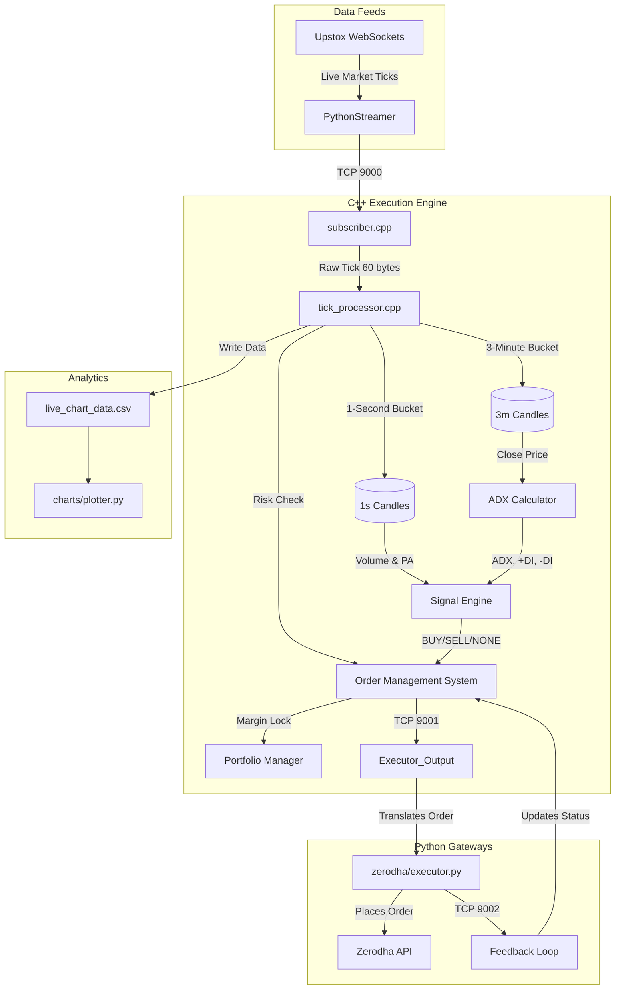

# AlgoTrade Code Review & Flowchart

## Global Architecture Flowchart
The following diagram illustrates the flow of data, state, and execution logic through the trading system:



---

## Code Review Findings

During the line-by-line review of the execution pipeline, models, and networking code, the following significant issues were identified:

### 1. **CRITICAL (Compile Error in Header)**
**Location**: [strategy/signal_engine.h](file:///c:/Users/emily/Music/AlgoTrade/strategy/signal_engine.h), Line 44-45
**Issue**: There is a missing comma after the `uint64_t candle_3m_ts` parameter in the [check_signal](file:///c:/Users/emily/Music/AlgoTrade/strategy/signal_engine.cpp#12-92) function declaration. The compiler will reject this file immediately.
```cpp
    Signal check_signal(double current_adx,
                        double current_plus_di,
                        double current_minus_di,
                        uint32_t current_volume,
                        uint64_t candle_3m_ts    // <--- MISSING COMMA HERE
                        double current_open,
                        double current_close
                    );
```

### 2. **CRITICAL (Compile Error in Unit Tests)**
**Location**: [tests/test_main.cpp](file:///c:/Users/emily/Music/AlgoTrade/tests/test_main.cpp), Lines 115, 117, 123, 125, 131, 133
**Issue**: The test cases invoke `engine.check_signal()` using only 5 arguments, but the method requires 7 arguments (the final two being `current_open` and `current_close`). This breaks the entire test suite compilation.
**Example**:
```cpp
// Current Code:
engine.check_signal(10.0, 0, 0, 100, 1000); 

// Should be:
engine.check_signal(10.0, 0, 0, 100, 1000, 0.0, 0.0); // Adding dummy open/close prices
```

### 3. **MINOR (Performance/Logic Optimization)**
**Location**: [core/engine/tick_processor.cpp](file:///c:/Users/emily/Music/AlgoTrade/core/engine/tick_processor.cpp), Line 111-115
**Issue**: The code eagerly calculates the `stop_loss` distance even if no valid signal was generated (`sig == Signal::NONE`). While the OMS ignores empty signals, computing mathematical boundaries when inactive is slightly inefficient. Moving the stop loss calculation inside the exact condition where orders are executed will tighten the hot path.

### 4. **WARNING (Feedback Network Disconnect)**
**Location**: [core/engine/subscriber.cpp](file:///c:/Users/emily/Music/AlgoTrade/core/engine/subscriber.cpp), Line 105
**Issue**: If the Python executor ([zerodha/executor.py](file:///c:/Users/emily/Music/AlgoTrade/gateways/zerodha/executor.py)) crashes, the [recv](file:///c:/Users/emily/Music/AlgoTrade/core/engine/network.h#16-27) loop pulling feedback on port 9002 catches the broken pipe. However, `break` terminates the entire trading system main-loop. This halts all live data streaming for a single interface failure. Depending on the desired system reliability, a reconnection mechanism might be preferred over a hard termination.

### Recommendation
I have documented everything. Let me know if you would like me to fix the missing comma and the compile errors in the test file immediately!
